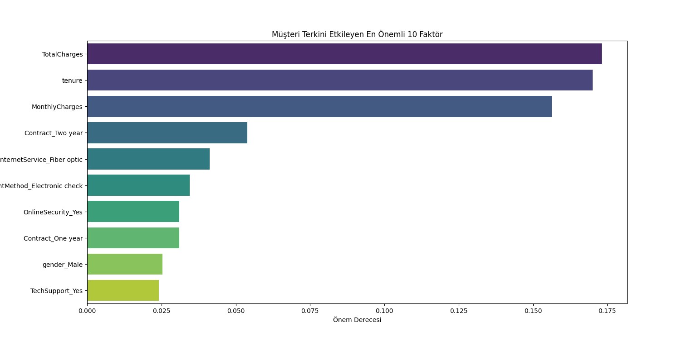

# Customer Churn Prediction (Machine Learning)

This project aims to predict customer churn using the IBM Telco Customer Churn dataset.
A supervised machine learning approach is applied to identify key factors influencing
customer attrition.

## Dataset
Publicly available IBM Telco Customer Churn dataset containing customer demographics,
service usage, and billing information.

## Methodology
- Data cleaning and preprocessing
- One-hot encoding of categorical variables
- Feature scaling using Min-Max normalization
- Train-test split (80/20)
- Class imbalance handling with `class_weight='balanced'`

## Model
- Random Forest Classifier
- Fixed random seed (`random_state=42`) for reproducibility

## Evaluation
- Accuracy score
- Confusion matrix
- Feature importance analysis
- Threshold optimization (0.30) to improve recall for churned customers

## Key Outcomes
- Optimized the decision threshold to 0.30, increasing the Recall rate from 51% to ~80%, successfully identifying high-risk customers.
- Identification of the most influential features affecting churn
- Visual analysis using feature importance plots and correlation heatmaps
- Identified that Month-to-month contracts and Electronic Check payments are the strongest predictors of churn, suggesting a need for long-term contract incentives.

## Tools & Libraries
Python, pandas, numpy, scikit-learn, matplotlib, seaborn

